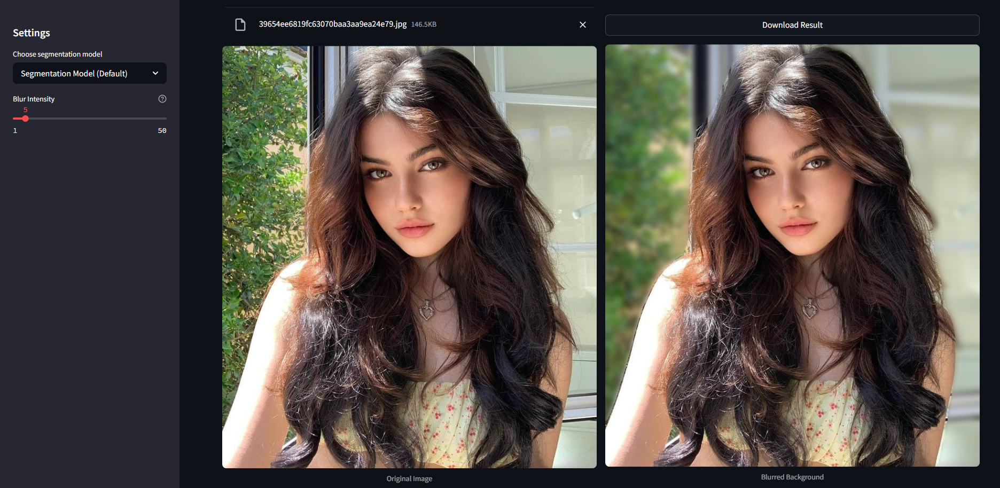

# BlurBlend 🖼️

[](https://blurblend.streamlit.app/)
[](https://github.com/kavishannip/BlurBlend)

BlurBlend is an AI-powered tool that automatically detects and separates foreground subjects from backgrounds in images and applies a professional-looking blur effect to the background while keeping the subject sharp and in focus.



---

## Features

- 🤖 **AI-Powered Segmentation**: Uses state-of-the-art image segmentation models to automatically detect people and other foreground objects.
- 🎚️ **Adjustable Blur**: Control the blur intensity with an easy-to-use slider.
- 🧠 **Multiple Models**: Choose from different AI models optimized for various use cases.
- ⚡ **GPU Acceleration**: Leverages CUDA when available for faster processing.
- 💾 **One-Click Download**: Easily download the processed images.

---

## Live Demo

Try out BlurBlend at [blurblend.streamlit.app](https://blurblend.streamlit.app/).

---

## How It Works

1. **Upload**: Select an image containing people or objects.
2. **Segment**: The AI model identifies foreground objects.
3. **Blur**: BlurBlend applies a blur effect to the background while keeping the foreground sharp.

---

## Available Models

- **Segmentation Model (Default)**: `facebook/mask2former-swin-base-coco-panoptic` - Best all-around segmentation.
- **Smaller Model**: `nvidia/segformer-b0-finetuned-ade-512-512` - Faster but less accurate.
- **Person Detection**: `facebook/detr-resnet-50-panoptic` - Specialized for people detection.
- **Person Detection+**: `mattmdjaga/segformer_b2_clothes` - Enhanced model that detects clothing items.

---

## Technical Implementation

The project consists of two main components:

### 1. BlurBlend Class

Handles the AI segmentation and blur application logic:
- Loads and manages AI segmentation models.
- Processes images to separate foreground from background.
- Applies configurable blur effects to the background.

### 2. Streamlit Web Interface

Provides a user-friendly interface:
- Upload and preview images.
- Configure segmentation model and blur settings.
- Process and download results.

---

## Installation

To run BlurBlend locally, follow these steps:

1. Clone the repository:
   ```bash
   git clone https://github.com/kavishannip/BlurBlend.git
   cd BlurBlend
   ```

2. Install the required dependencies:
   ```bash
   pip install -r requirements.txt
   ```

3. Run the Streamlit app:
   ```bash
   streamlit run app.py
   ```

---

## Usage

### Basic Usage of `BlurBlend` Class

```python
from blurblend import BlurBlend

# Initialize with chosen model
blur_tool = BlurBlend(model_path="facebook/mask2former-swin-base-coco-panoptic")

# Process an image
result_image = blur_tool.process_image(
    image_path="path/to/image.jpg",
    blur_radius=15
)

# Save the result
result_image.save("blurred_background.png")
```

### Running the Web App

1. Open the app in your browser after running `streamlit run app.py`.
2. Upload an image, configure the blur intensity, and select the segmentation model.
3. Click "Apply Background Blur" to process the image.
4. Download the result using the provided button.

---

## Requirements

The following dependencies are required to run BlurBlend:

- `streamlit>=1.22.0`
- `transformers>=4.30.0`
- `torch>=2.0.0`
- `Pillow>=9.0.0`
- `numpy>=1.24.0`
- `scipy>=1.10.0`
- `timm>=0.9.0`

Install them using:
```bash
pip install -r requirements.txt
```

---


## Contributing

Contributions are welcome! If you have ideas for improvements or new features, feel free to open an issue or submit a pull request.

---

## License

This project is licensed under the MIT License. See the [LICENSE](LICENSE) file for details.

---

## Author

Developed by [Kavishan Nipun](https://www.linkedin.com/in/kavishan-nipun-876930222/).

[](https://github.com/kavishannip)
[](https://www.linkedin.com/in/kavishan-nipun-876930222/)